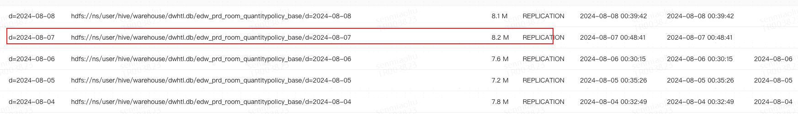

### job 耗时异常

0807 job 耗时异常


查看执行计划，卡在bhj join，有长尾task，部分task 耗时较长


对比之前job，执行计划都为bhj，但是task数量比较少，

- 耗时异常job  `application_1716531657697_9775710`

- 正常job   `application_1716531657697_9665729`


对比bhj执行计划异常job多了一次shuffle read


测试机器 重跑sql，发现执行计划为smj，耗时正常


对比spark conf，zeus job 配置了`spark.sql.adaptive.autoBroadcastJoinThreshold`参数


### aqe bhj 优化

aqe 参数 

```
spark.sql.adaptive.autoBroadcastJoinThreshold
```

在aqe开启时生效，可以根据表run time stats动态选择是否使用bhj

spark3之前做过优化，计算stats时候会进行裁剪优化[Spark3分区裁剪优化](https://git.dev.sh.ctripcorp.com/framework-di/spark/-/issues/309),
在这个case，因为表分区大小比`spark.sql.autoBroadcastJoinThreshold`大



所以spark默认使用smj，会使用shuffle exchange read，aqe优化为bhj的时候不会消除这个shuffle read，所以导致并行度降低，速度变慢


### 解决方案

因为job使用bhj也没有oom，调整`spark.sql.autoBroadcastJoinThreshold`参数，让job 初始计划使用bhj，避免shuffle read

输出smj -> bhj 的日志，

## 附录

<details>
<summary> sql </summary>

```sql
select 
    a.createtime
    , a.version
    , a.hotelid
    , a.masterhotelid
    , a.roomid
    , a.effectdate
    , a.startdate
    , a.enddate
    , a.canoverflow
    , a.reservetime
    , if(a.restorable = 'true','T',if(a.restorable = 'false','F',a.restorable)) as restorable
    , if(a.freesale = 'true','T',if(a.freesale = 'false','F',a.freesale)) as freesale
    , a.isdel_htl
    , a.lst_upd_time
    , a.data_src
    , a.datachangelasttime
    , a.inland
from dwhtl.edw_prd_room_quantitypolicy a 
left join 
(
    select distinct createtime, version, masterhotelid, hotelid, isdel_htl
    from dwhtl.edw_prd_room_quantitypolicy_base b 
    where d = '2024-08-07'
) b 
on cast(a.hotelid as string)= cast(b.hotelid as string)
where a.d = '2024-08-06'
and a.hotelid>0
and a.effectdate >= '2024-08-06'
and ((b.version is not null and a.version is not null and concat(a.version,a.createtime) > concat(b.version,b.createtime))
or (b.version is not null and a.version is null and a.createtime > b.createtime) ) 
```
</details>