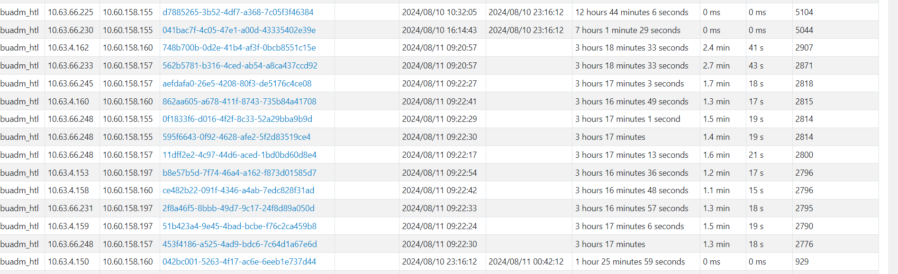
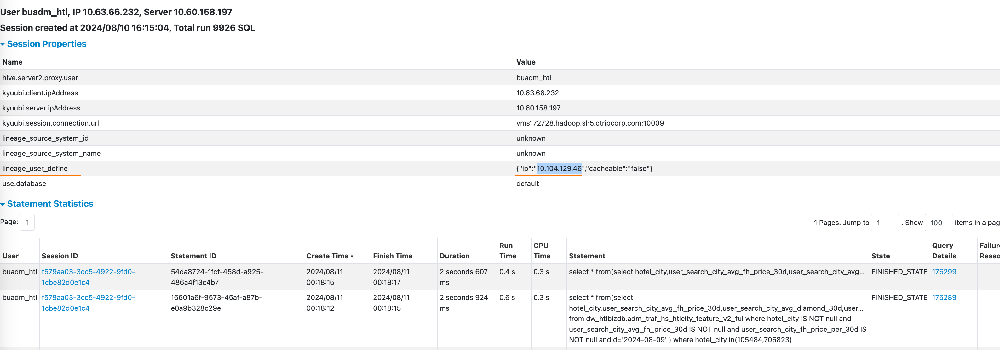
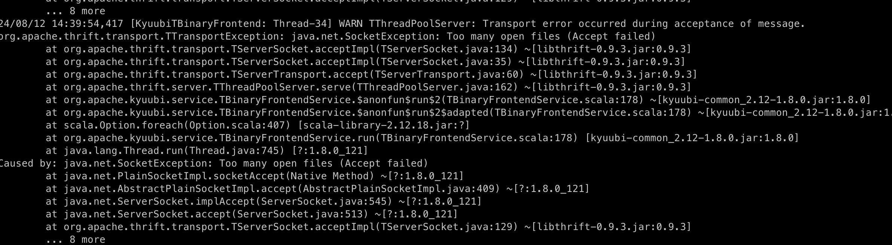

### kyuubi 异常

- 8月10日 22:43:06   1190188 server 监控异常

  查看日志，连接vms172729异常

- 发现机器日志大量输出Too many open files 日志

```
24/08/10 23:15:52,016 [KyuubiTBinaryFrontend: Thread-31] WARN TThreadPoolServer: Transport error occurred during acceptance of message.
org.apache.thrift.transport.TTransportException: java.net.SocketException: Too many open files (Accept failed)
	at org.apache.thrift.transport.TServerSocket.acceptImpl(TServerSocket.java:134) ~[libthrift-0.9.3.jar:0.9.3]
	at org.apache.thrift.transport.TServerSocket.acceptImpl(TServerSocket.java:35) ~[libthrift-0.9.3.jar:0.9.3]
	at org.apache.thrift.transport.TServerTransport.accept(TServerTransport.java:60) ~[libthrift-0.9.3.jar:0.9.3]
	at org.apache.thrift.server.TThreadPoolServer.serve(TThreadPoolServer.java:162) ~[libthrift-0.9.3.jar:0.9.3]
	at org.apache.kyuubi.service.TBinaryFrontendService.$anonfun$run$2(TBinaryFrontendService.scala:102) ~[kyuubi-common_2.12-1.6.1-incubating.jar:1.6.1-incubating]
	at org.apache.kyuubi.service.TBinaryFrontendService.$anonfun$run$2$adapted(TBinaryFrontendService.scala:102) ~[kyuubi-common_2.12-1.6.1-incubating.jar:1.6.1-incubating]
	at scala.Option.foreach(Option.scala:407) ~[scala-library-2.12.15.jar:?]
	at org.apache.kyuubi.service.TBinaryFrontendService.run(TBinaryFrontendService.scala:102) ~[kyuubi-common_2.12-1.6.1-incubating.jar:1.6.1-incubating]
	at java.lang.Thread.run(Thread.java:745) ~[?:1.8.0_121]
Caused by: java.net.SocketException: Too many open files (Accept failed)
	at java.net.PlainSocketImpl.socketAccept(Native Method) ~[?:1.8.0_121]
	at java.net.AbstractPlainSocketImpl.accept(AbstractPlainSocketImpl.java:409) ~[?:1.8.0_121]
	at java.net.ServerSocket.implAccept(ServerSocket.java:545) ~[?:1.8.0_121]
	at java.net.ServerSocket.accept(ServerSocket.java:513) ~[?:1.8.0_121]
	at org.apache.thrift.transport.TServerSocket.acceptImpl(TServerSocket.java:129) ~[libthrift-0.9.3.jar:0.9.3]
	... 8 more
```
- 手动重启后恢复

### 排查

机器残留大量 `server_operation_logs`，查看日志是同一user提交大量相似sql，





用户debug job调用router artnova 执行大量sql查询，kill后server 恢复

kyuubi会在session close 后删除 operation log，由于这个job 同时开了多个session，每个session执行大量的sql，使得server open文件数过多，存在大量`server_operation_logs`，最终异常

### 复现

构造多个session，每个执行大量sql

```scala
import java.sql._
val url = "jdbc:hive2://hive-zk1.hadoop.ctripcorp.com,hive-zk2.hadoop.ctripcorp.com,hive-zk3.hadoop.ctripcorp.com/default;serviceDiscoveryMode=zooKeeper;zooKeeperNamespace=kyuubi_adhoc_test_16#kyuubi.engine.type=SPARK_SQL"

val open = DriverManager.getConnection("url")
val open1 = DriverManager.getConnection("url")
val open2 = DriverManager.getConnection("url")
val open3 = DriverManager.getConnection("url")
val open4 = DriverManager.getConnection("url")

(1 to 20000).map{ a => open.createStatement().executeQuery(s"select $a")
         open1.createStatement().executeQuery(s"select $a")
         open2.createStatement().executeQuery(s"select $a")
         open3.createStatement().executeQuery(s"select $a")
         open4.createStatement().executeQuery(s"select $a")
      }

```

server 复现 `[hive@VMS174752 kyuubi]`



### 后续

- 完善zeus 监控 kyuubi server job，从zk获取server node，遍历进行查询，查询超时
- 限制单个session 执行sql最大数量
- 支持operation log 关闭
  


## 附录

### 参考文献